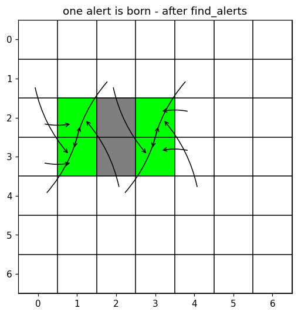
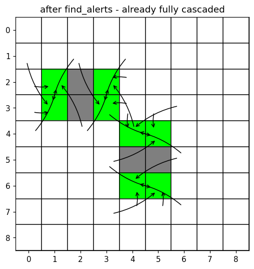
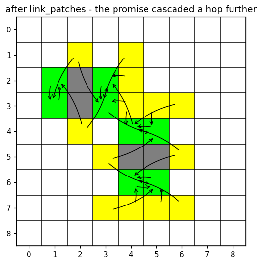
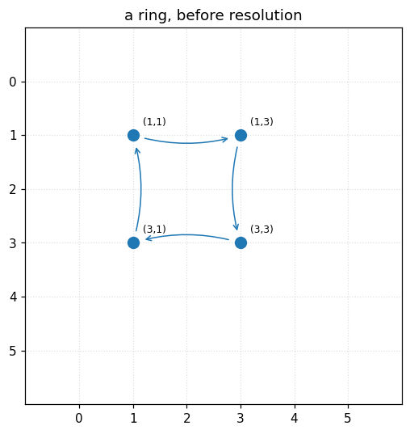
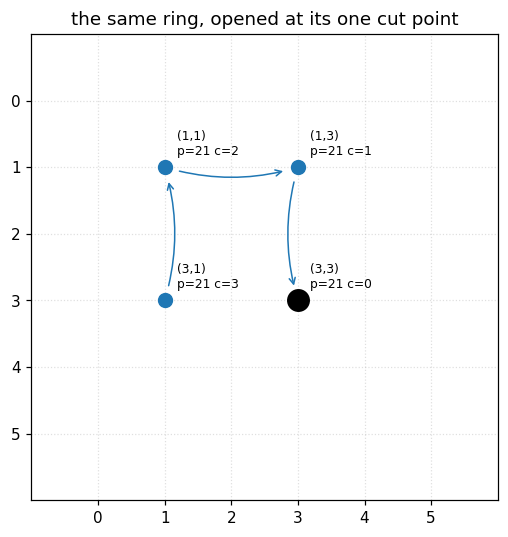
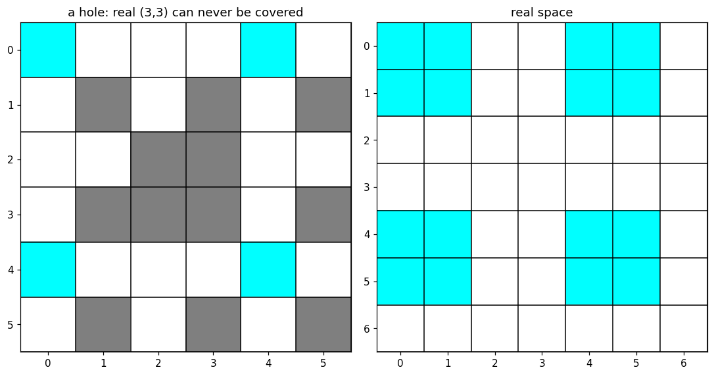
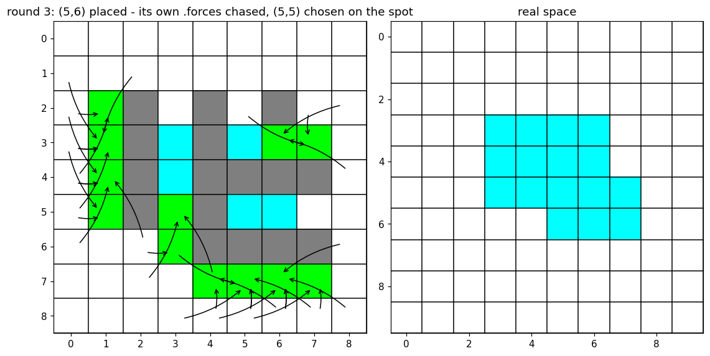
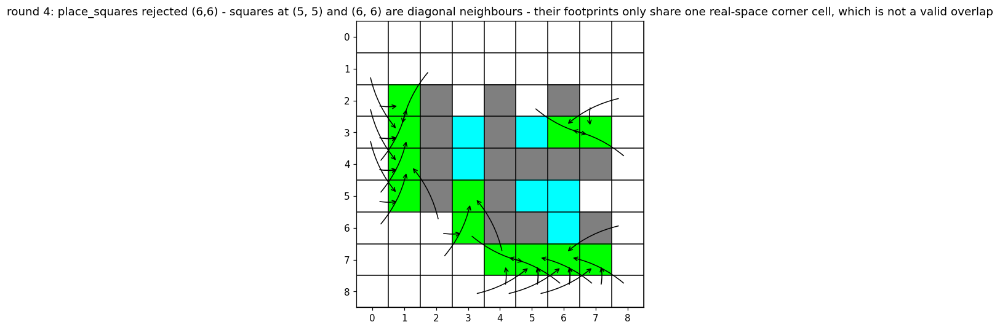

# Cascades, and why holes can't happen

Written by Rose (and Wolfgang for section 5), for Andi and Ivo. Companion to
`test_rose_cascades_and_holes.py` and `test_rose_wolfgang_hole_motivation.py`
(repo root) - run either with plain `python3` to regenerate these images and
re-check every claim below against the actual code. Sections 1-4 build a
chosen/blocked map directly and run it through `find_alerts` / `link_patches` /
`resolve_cycles_and_centrality` / `check_tiling_invariant`; section 5 also uses
`forced_closure` / `reset_alert_bookkeeping`, both new tonight.

## The vocabulary, in pictures

Every image below is `map_of_squares`: white = free, cyan = chosen, grey = blocked,
**blue = alert_blocked, yellow = alert_chosen, green = both at once**. Black arrows
are `.forced_by` -> the item pointing at you is what forces you to eventually be
chosen.

**Seat** (new, team-wide as of today): a 2x2 block with 3 corners blocked and 1
free - the free one is the seat, and an alert_chosen item is what must sit in it.
This is the same shape closure.py's own code calls "an alert" as a noun (see
`find_alerts`'s docstring: "an alert is a 2x2 block with three items blocked and
one free") - "seat" is our name for that shape when we talk and write about it; the
code identifiers themselves (`alert_blocked`, `alert_chosen`, `find_alerts`) are
unchanged, that's not ours to rename. If "seat" sticks, it's worth asking Andi/Ivo
to rename it in the source too.

## 1. Where a seat comes from

Two blocked cells, stacked vertically. That alone is enough to threaten the seats
forming on either side of them: each side is one corner short of becoming a real
seat (3 blocked, 1 free). `find_alerts` catches both sides anyway, before either
seat is even fully formed - the cell that would complete each seat (blue,
"alert_blocked") gets paired with the corner that would be left as the seat itself
(yellow, "alert_chosen"): *if the blue cell ever gets blocked too, completing the
seat, the yellow cell is guaranteed to sit in it, no matter what.* That guarantee
is recorded right now - not discovered later as a surprise once the seat's already
formed.

## 2. How that guarantee cascades

Two of these seats-in-waiting, built far apart, turn out to sit diagonally next to
each other. That's the trigger for a second hop: choosing either alert_blocked cell
would block the *other* one - and that other one already has its own guarantee
pending, protecting a seat of its own. So each promise reaches past its neighbour
to that neighbour's own promise - not as a follow-up correction, but directly:
set_alert_chosen links every free diagonal neighbour of an alert_blocked cell
straight to that cell's own seat, in the same single pass that discovers the cell
is alert_blocked at all, so the two images above are pixel-for-pixel identical -
there's nothing left for a second stage to add. **A cascade is just this same
link happening wherever it turns out to apply** - nothing more exotic than "does my
blocking also threaten someone who already made a promise of their own?", asked
everywhere at once, on a consistent snapshot of the board so it doesn't matter
which cell gets checked first.

This is also why closure has to run after every placement round rather than only
at the end: an unresolved seat-in-waiting sitting on the board is a cascade waiting
to be triggered by literally anything landing on its doorstep later - closure's job
is to find and record every one of those triggers immediately, while it's still
cheap, not to react after the fact.

## 3. The one shape that needs a tie-breaker: a ring

A chain of promises normally ends somewhere - a "terminal" cell with no promise of
its own, which is the safe place to start counting from. A *ring* has no such cell
by construction: everyone in it points to someone else in it. Nothing is safe to
resolve first. This needs a separate, one-time step (`find_cycle_patches`): every
cell on the ring proposes its own index, the largest one always wins by the time it
travels all the way around, and *that* cell has its promise cut - manufacturing a
terminal artificially, at exactly one point on the ring, chosen the same way no
matter which cell happens to get processed first. After that cut, the ring is just
an ordinary chain again, and gets the same centrality/path_id treatment everything
else does (see the "p=21 c=..." labels - one shared patch, distance-from-terminal
counted outward from the cut).

## 4. What we're actually preventing

This is the one deliberately broken example: all 4 corners of one seat forced
blocked directly - including the seat itself, which should never be allowed to be
anything but occupied - skipping the machinery entirely (this is exactly the state
it exists to prevent reaching). `check_tiling_invariant` catches it immediately -
but the real-space panel on the right is the concrete cost if it weren't caught.
Each chosen square stamps a 2x2 patch of *real* pixels, shared with its immediate
neighbours; the one real pixel sitting at the shared corner of all four blocked
cells can only ever be stamped by one of those four specific cells being chosen.
With all four permanently vetoed - no seat left standing - that single pixel is
unreachable forever, no matter what gets chosen anywhere else on the board, for the
rest of time. (Only that exact centre pixel is provably stuck this way in this
picture - the rest of the visible white area around it is just sparse because this
demo board is small and mostly empty, not because it's similarly doomed.) Every
seat/cascade mechanism above exists to guarantee this specific picture never
happens on a real board - by promising, in advance, that some corner always stays
claimable (a seat always gets sat in) before the board ever gets a chance to close
in on it from all four sides at once.

## 5. Motivating the rule: a "harmless-looking" placement that already fails

Everything above hand-forces the hole to show the mechanism; this one doesn't.
Companion file: `test_rose_wolfgang_hole_motivation.py` (repo root), written after
Ivo pointed at `test_impossible.py::test_other_full_2x2` and asked us to motivate
the rule by *naively placing squares*, not hand-forcing state.

Four squares - (3,3), (4,3), (5,6), (6,6) - placed in one call. None of them is a
diagonal neighbour of another, so `place_squares` accepts all four without
complaint - looks completely reasonable. But each one's diagonal-blocking footprint
happens to land on a different corner of the exact same seat, {(4,4),(4,5),(5,4),
(5,5)}. All four corners end up blocked, in one shot, before `find_alerts` ever
gets to run once. `(5,5)` is unreachable from the moment `place_squares` returns -
verified directly (`m[5,5].state == StateEnum.blocked`), and
`check_tiling_invariant` confirms it.

That much motivates "closure needs to run often." The sharper finding - not
something we went looking for, it fell out of testing the obvious follow-up
question - is that running closure often is not enough by itself. Placing the
*same* four squares one at a time, with `find_alerts`/`link_patches`/
`remove_blocked_links` run after each one (exactly the discipline the real
algorithm is supposed to follow): closure correctly flags `(5,5)` as
`alert_chosen` - a recorded promise - two whole placements before the danger is
even complete. And then the fourth placement, (6,6), is still silently allowed to
block it anyway. `place_squares` only refuses two *chosen* squares being diagonal
neighbours of each other; nothing currently checks "is this diagonal to a cell
that's already `alert_chosen`?" before allowing a choice. The promise gets
correctly written down and then quietly broken by the very next placement.

That's the real shape of what the seat mechanism needs in order to actually work:
not just *detecting* a seat and promising its occupant, but something that also
*protects* that promise against every placement that comes after it. **Update,
same night:** this motivated `closure.forced_closure` - after each manual
placement, walk that item's own `.forces` chain (transitively) and place
everything it reaches too, right then, instead of leaving it as a passive record.
Re-running this exact scenario with `forced_closure` wired in: by the time `(5,6)`
would be placed, it *already* carries `.forces == {(3,5), (5,5)}` from the
previous round's closure pass - chasing that chain places `(5,5)` (and `(3,5)`) as
genuinely `chosen`, on the spot, before the danger ever completes. The would-be
fourth placement, `(6,6)`, is then rejected outright by `place_squares`'s own
diagonal-overlap check, because `(5,5)` is no longer merely promised - it's
already a real chosen square. Recording and enforcing used to be two different
things where only the first existed; now the second exists too, for this
scenario. See `test_rose_wolfgang_hole_motivation.py` for the full run.

Not a general guarantee, though, and the test's own docstring says so directly:
which square gets placed in what order is still an external choice, made by
whatever calls `place_squares` - a *different* order could still let some
unrelated placement block a promise before that promise's own `.forces` chain
ever gets a turn to fire. What's shown here is narrower but real: for this
scenario, the step that was missing - actually acting on what closure already
knew - would have caught the problem before it happened, not after. Whether that
holds for *every* order, on *every* board, is Wolfgang's now more precisely
scoped open question (3b in his notes), not something this page settles.

## One honest caveat

Section 4's hole example is hand-forced - it skips the placement process entirely
to show the forbidden end-state directly. Section 5 is not hand-forced, and even
with `forced_closure` now acting on recorded promises, it does *not* by itself
prove the real incremental algorithm can never reach a hole on its own for *every*
placement order - only that it didn't for this one, once enforcement was added.
That's Wolfgang's open question now (3a: can two recorded promises ever
contradict each other; 3b: does enforcement hold for every order, not just the
one tried here - see his notes). What this page shows is the *mechanism* the code
uses to try to prevent a hole, and exactly how much further it reaches tonight
than it did this morning.
